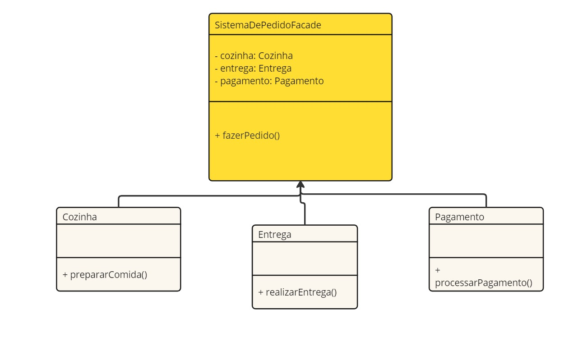

# Padrão de Projeto Facade

## Conceito:
O **padrão Facade** oferece uma interface simplificada para um conjunto de interfaces em um subsistema, facilitando a interação com sistemas complexos. Ele proporciona um ponto de entrada único para acessar diferentes funcionalidades e simplifica a utilização do subsistema, sem expor a complexidade interna.

## Problema que Resolve:
Este padrão resolve o problema de sistemas complexos que possuem múltiplas interações internas entre várias classes. Sem o padrão Facade, o cliente precisaria interagir com muitas classes diferentes para realizar uma única tarefa. O Facade esconde essa complexidade, oferecendo uma interface mais simples e intuitiva.

## Quando Usar:
- Quando você tem um sistema complexo com vários subsistemas e deseja simplificar a interação com eles.
- Quando você deseja desacoplar o código cliente do subsistema, proporcionando maior flexibilidade e facilidade de manutenção.
- Quando diferentes subsistemas possuem interfaces complexas e você quer simplificar a interação do cliente com esses subsistemas.

## Exemplo de Código:

Este código implementa o padrão Facade para um sistema de pedido de comida, onde a classe SistemaDePedidoFacade oferece uma interface simples para o cliente realizar um pedido. A Facade interage com três subsistemas: Cozinha, Entrega e Pagamento. O método fazerPedido() da classe Facade chama as operações dos subsistemas na ordem correta: primeiro prepara a comida, depois processa o pagamento e, por fim, realiza a entrega. Isso permite que o cliente faça um pedido sem precisar interagir diretamente com os detalhes de cada subsistema, tornando o sistema mais simples de usar e gerenciar.

## Diagrama UML:

## Vantagens:
- Redução de Complexidade: A interação com os subsistemas complexos é simplificada, facilitando o uso do sistema por clientes.
- Desacoplamento: O padrão ajuda a desacoplar o cliente do subsistema, permitindo que o cliente interaja apenas com a Facade, sem a necessidade de conhecer as classes do subsistema.

## Desvantagens:
- Ocultação da Complexidade: Em alguns casos, esconder a complexidade interna pode não ser desejável, especialmente se o cliente precisar de controle mais direto sobre as operações dos subsistemas.
- Ponto de Falha Único: A Facade pode se tornar um ponto de falha único, já que ela centraliza o acesso a vários subsistemas.
