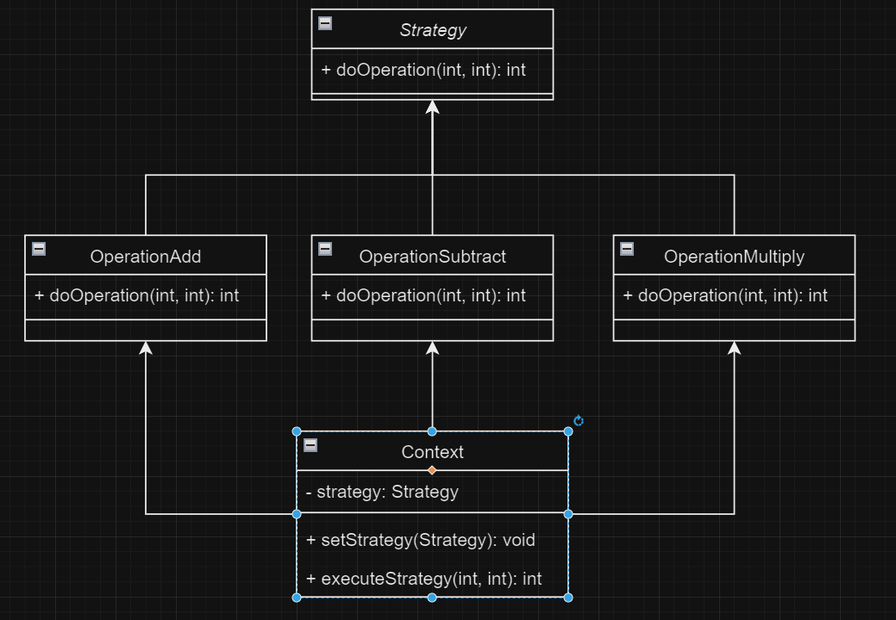

# Strategy Example

Este repositório contém um exemplo de implementação do padrão de projeto Strategy. O padrão Strategy permite que um algoritmo varie independentemente dos clientes que o utilizam.

## Estrutura UML

Abaixo está o diagrama UML que representa a estrutura do padrão Strategy:



## Descrição

O padrão Strategy define uma família de algoritmos, encapsula cada um deles e os torna intercambiáveis. O padrão permite que o algoritmo varie independentemente dos clientes que o utilizam.

## Componentes

- **Context**: Mantém uma referência a um objeto Strategy.
- **Strategy**: Interface comum para todos os algoritmos suportados.
- **ConcreteStrategy**: Implementa o algoritmo usando a interface Strategy.

## Exemplo de Código

```java
// Interface Strategy
public interface Strategy {
    void execute();
}

// Implementações concretas de Strategy
public class ConcreteStrategyA implements Strategy {
    public void execute() {
        System.out.println("Executando a estratégia A");
    }
}

public class ConcreteStrategyB implements Strategy {
    public void execute() {
        System.out.println("Executando a estratégia B");
    }
}

// Contexto que utiliza uma Strategy
public class Context {
    private Strategy strategy;

    public void setStrategy(Strategy strategy) {
        this.strategy = strategy;
    }

    public void executeStrategy() {
        strategy.execute();
    }
}

// Exemplo de uso
public class StrategyExample {
    public static void main(String[] args) {
        Context context = new Context();

        context.setStrategy(new ConcreteStrategyA());
        context.executeStrategy();

        context.setStrategy(new ConcreteStrategyB());
        context.executeStrategy();
    }
}
```
