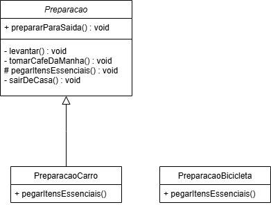

# Padrão Template Method

## Conceito

O padrão Template Method define o esqueleto de um algoritmo em uma operação, deixando alguns passos a serem implementados pelas subclasses. Ele permite que subclasses redefinam certos passos de um algoritmo sem mudar a estrutura do algoritmo.

## Problema

É útil quando você tem um algoritmo com passos que podem ser variáveis ou específicos para subclasses, mas o esqueleto do algoritmo deve permanecer o mesmo.

## Quando Usar

- Quando várias classes diferem apenas na implementação de alguns passos de um algoritmo.
- Para evitar duplicação de código, encapsulando a estrutura invariável do algoritmo em uma classe base.
  
## Diagrama UML



## Exemplo de Código

```java
// Classe Abstrata Template
public abstract class Template {
    public final void templateMethod() {
        baseOperation();
        requiredOperation1();
        requiredOperation2();
        hook();
    }

    private void baseOperation() {
        System.out.println("Base operation performed");
    }

    protected abstract void requiredOperation1();
    protected abstract void requiredOperation2();

    protected void hook() {
        // Hook operation
    }
}

// Implementação Concreta do Template
public class ConcreteClass extends Template {
    @Override
    protected void requiredOperation1() {
        System.out.println("ConcreteClass: Operation1 performed");
    }

    @Override
    protected void requiredOperation2() {
        System.out.println("ConcreteClass: Operation2 performed");
    }

    @Override
    protected void hook() {
        System.out.println("ConcreteClass: Hook operation performed");
    }
}

// Código Cliente
public class Client {
    public static void main(String[] args) {
        Template template = new ConcreteClass();
        template.templateMethod();
    }
}
