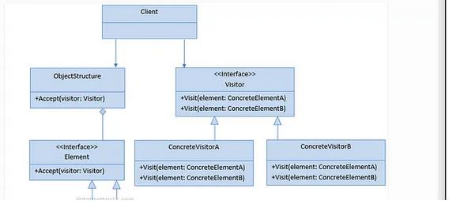

# Padrão de Projeto Visitor

## Conceito:

O **padrão Visitor** é um padrão comportamental que permite adicionar novos comportamentos a uma hierarquia de classes existente sem modificar essas classes. Ele separa os algoritmos da estrutura dos objetos sobre os quais operam, permitindo a criação de novas operações sem alterar as classes originais.

## Problema que Resolve:

Este padrão resolve o problema de adicionar novas funcionalidades a um conjunto de classes sem modificar sua estrutura original. Sem o Visitor, cada nova operação exigiria modificações diretas nas classes existentes, violando o princípio Open/Closed (aberto para extensão, fechado para modificação). O Visitor permite que novas operações sejam adicionadas de forma flexível e independente.

## Quando Usar:

- Quando você precisa realizar operações complexas em uma estrutura de objetos com diferentes tipos
- Quando deseja adicionar comportamentos a uma hierarquia de classes sem modificar essas classes
- Quando tem um conjunto de classes com interfaces estáveis e operações que mudam frequentemente
- Em situações que envolvem operações heterogêneas em uma hierarquia de classes

## Exemplo de Código:

Este código demonstra o padrão Visitor em um sistema de processamento de documentos. A interface `DocumentVisitor` define métodos de visita para diferentes tipos de documentos (PDF, Word, Texto). Cada documento concreto implementa o método `accept()`, que permite que um visitor realize operações específicas.

No exemplo, criamos dois visitors concretos: `ExportVisitor` e `PrintVisitor`. Cada visitor implementa operações diferentes para os tipos de documentos, como exportação e impressão. O cliente pode adicionar novos comportamentos (como um `EncryptVisitor`) sem modificar as classes de documentos existentes.

## Diagrama UML:

O diagrama ilustra a estrutura do padrão Visitor, mostrando:

- A interface Visitor com métodos para visitar cada tipo de elemento
- A interface Element com o método accept()
- Visitors concretos que implementam operações específicas
- Elementos concretos que aceitam visitors

## Vantagens:

- **Facilidade de Extensão**: Permite adicionar novas operações sem modificar classes existentes
- **Centralização de Operações**: Agrupa operações relacionadas em classes de visitors
- **Separação de Responsabilidades**: Mantém as classes de elementos focadas em sua estrutura básica
- **Princípio Open/Closed**: Permite estender o comportamento sem alterar código existente

## Desvantagens:

- **Complexidade Adicional**: Introduz novas classes e interfaces, aumentando a complexidade do sistema
- **Quebra de Encapsulamento**: Requer que os elementos exponham sua estrutura interna para o visitor
- **Modificações Estruturais**: Adicionar um novo tipo de elemento requer atualização em todos os visitors existentes
- **Overhead**: Pode adicionar sobrecarga de processamento devido à indireção criada pelo padrão
